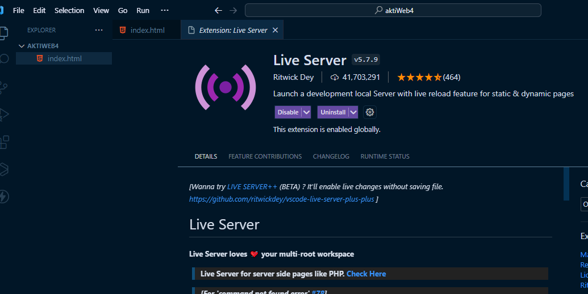

<h1>Project Documentation </h1>

<h2>Project Description</h2>

ye project bht acha hai

<h3>Folder Structure</h3>

Pges => urls

Api calls from services

Constanst folder contains the base url, api version and api endpoints

<h2>Screen Shots</h2>

<h1> Backend Documentation</h1>

 Backend ka folder structure

index.js starting point
    config k folder mei db connection
    routes k folder, 
    controller jis mei main business logc liki hai
    models ka folder, jis mei database k schema liky hain

<h2>Apis</h2>

<h3> Server Address: http://localhost:3000 </h3>

<h4>Api to add add product</h4>

Method: post

endPoint: /api/v1/add-product

<table>
  <tr>
    <th>Company</th>
    <th>Contact</th>
    <th>Country</th>
  </tr>
  <tr>
    <td>Alfreds Futterkiste</td>
    <td>Maria Anders</td>
    <td>Germany</td>
  </tr>
</table>